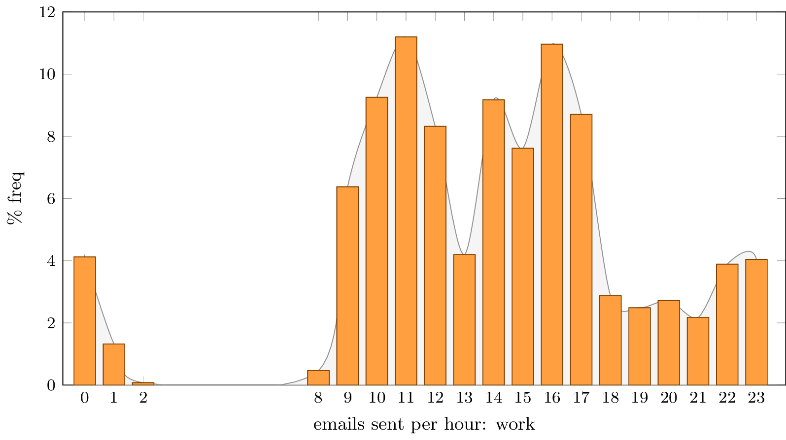
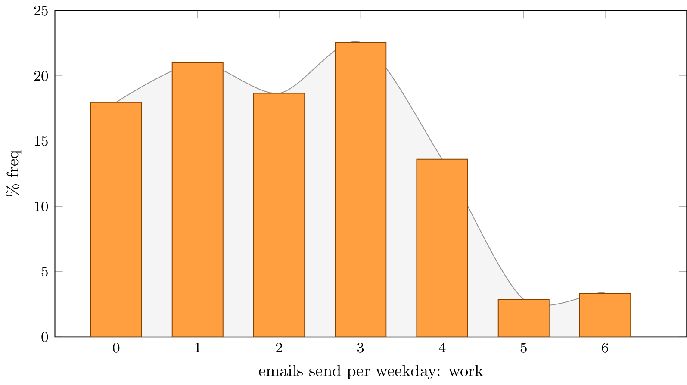

mmails
======
measure email behavior

Requirements
------------
You just need python3 installed.
For creating of pdfs/pngs you need
* texlive (tikz)
* convert (imagemagick)

Usage
-----

First you should export your sent emails, e.g. using thunderbird, as a mbox file MBOX
Now you can start analyzing your emails with:
> ./mmails.py MBOX --suffix MYEMAILS

After processing your mails, two tex files will be created, they can be compiled and converted to pdf/png using
> ./convert.sh

(convert.sh needs texlive with tikz and imagemagick)

General Usage
-------------
```
usage: mmails.py [-h] [--suffix SUFFIX] mbox

analyze mbox file

positional arguments:
  mbox             mbox input file

optional arguments:
  -h, --help       show this help message and exit
  --suffix SUFFIX  optinal output suffix

stg7 2015
```

Examples
--------
Emails per hour diagram:

Emails per weekday diagram:
